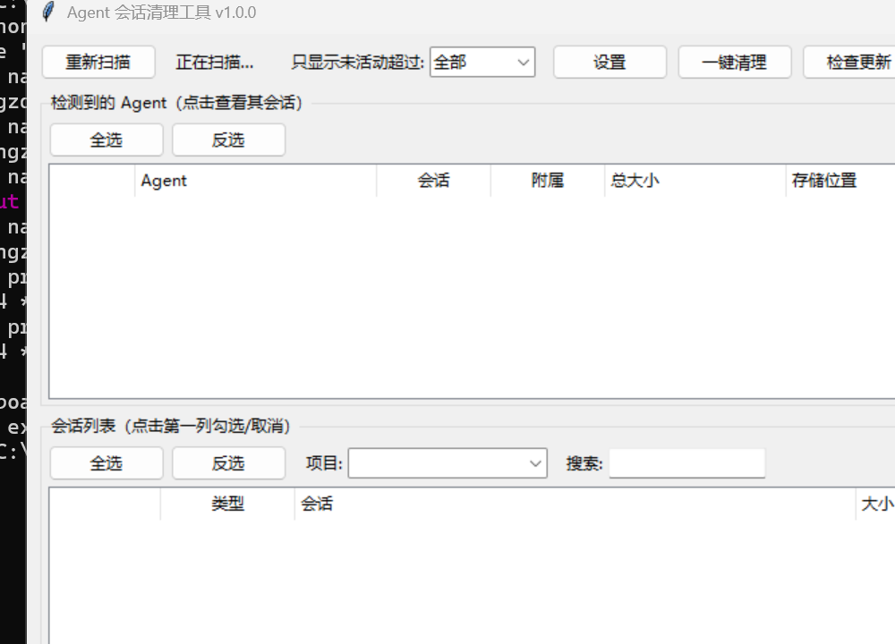

# 🧹 Agent Session Cleaner

> English | [中文](README.md)


A cross-platform desktop GUI tool to scan and clean up session and cache data accumulated by various AI agents. **Deletion goes to the recycle bin / trash by default (recoverable).**

Built with pure Python standard library + Tkinter, zero third-party dependencies.

## ✨ Features

- 🖥️ Cross-platform desktop app (Windows / macOS / Linux)
- 🤖 Supports **17 mainstream AI agents** (see below)
- 🗑️ Deletion goes to recycle bin by default (recoverable); permanent deletion requires double confirmation
- 🧹 Sessions and auxiliary data (cache/logs) cleaned separately; auxiliary data unchecked by default
- ⏱️ Time filter: show only sessions inactive for 7 / 30 / 90+ days
- 📂 Project filter + 🔍 session search: quickly locate by project / keyword
- 🚀 One-click cleanup: pick a day range in a dialog (default 30 days) to clear old sessions of all agents
- 🔁 Invert selection: quickly flip checkbox states
- ⚙️ Custom paths: auto-detect official env vars + manual config in settings UI (directory picker)
- 📊 Background-thread scanning / cleaning with real-time progress; UI never freezes
- 📜 Clean history: view / clear a summary of past cleanups in Settings
- 🔍 Double-click a session for details; right-click to open its storage folder
- 🔄 Update check on startup / manually (GitHub Releases)
- 📦 Three-platform auto build & release (GitHub Actions)

## 📸 Screenshots



## 🚀 Quick Start

### Option 1: Download binaries

Download the installer for your platform from [GitHub Releases](https://github.com/git-wangzd/agent-cleaner/releases) (Windows / macOS / Linux). No Python installation required.

### Option 2: Run from source (requires Python 3.10+)

```bash
python main.py          # launch the GUI
python main.py --list   # CLI mode: print scan results only
# Headless cleanup (schedule it with cron / Task Scheduler):
python main.py --clean 30                    # clean sessions inactive > 30 days (to recycle bin)
python main.py --clean 30 --permanent --yes  # permanent delete (requires explicit --yes)
python main.py --clean 30 --quiet            # quiet mode, no progress output
```

## 🤖 Supported Agents

| Agent | Storage location (Windows) |
|---|---|
| Claude Code | `%USERPROFILE%\.claude\projects` + `sessions` |
| Codex CLI | `%USERPROFILE%\.codex\sessions` |
| Cursor | `%APPDATA%\Cursor\User\workspaceStorage` |
| Windsurf | `%APPDATA%\Windsurf\User\workspaceStorage` |
| OpenCode | `%USERPROFILE%\.local\share\opencode` (SQLite / files) |
| Gemini CLI | `%USERPROFILE%\.gemini\tmp` |
| Continue | `%USERPROFILE%\.continue\sessions` |
| Cline | `%APPDATA%\Code\User\globalStorage\saoudrizwan.claude-dev` |
| Qwen Code | `%USERPROFILE%\.qwen\projects` |
| Kimi CLI | `%USERPROFILE%\.kimi` |
| Tongyi Lingma | `%USERPROFILE%\.lingma\index\chat` |
| Trae | `%APPDATA%\Trae\User\workspaceStorage` |
| MarsCode CLI | `%USERPROFILE%\.marscode` |
| Pi | `%USERPROFILE%\.pi\agent\sessions` |
| AtomCode | `%USERPROFILE%\.atomcode\sessions` |
| MimoCode | `%USERPROFILE%\.local\share\mimocode` (SQLite) |
| ZCode | `%USERPROFILE%\.zcode\cli\db\db.sqlite` (SQLite) + `cli\exec` cache |

## 📖 Usage Guide

1. Launch the app; all agents are scanned automatically
2. Check an agent (whole package) or individual sessions (use time/project filters + search to locate)
3. Click "Move to recycle bin" (recoverable) or "Delete permanently" (double confirmation)
4. Progress is shown in real time; the list refreshes automatically when done

### Common operations

| Action | Description |
|---|---|
| Time filter | Top dropdown: 7/30/90 days, shows only older inactive sessions |
| One-click cleanup | Pick days, click "One-click cleanup" to clear old sessions of all agents |
| Project filter / search | Filter by project or search by keyword in the session list header |
| View details | Double-click a session row for metadata details |
| Open path | Right-click an agent / session row → open storage folder |
| Settings | Top "Settings" button: path overrides, big-file threshold |

## 🛡️ Safety

- Deletion goes to the recycle bin by default (recoverable); permanent deletion requires double confirmation
- Auxiliary data (cache/logs) is unchecked by default
- Cleaning OpenCode / MimoCode / ZCode sessions manipulates their SQLite databases — quit the corresponding agent first
- Directories that may contain user data (`downloads` / `backups` / memory files) are **never** listed

## ❓ FAQ

**Q: Can deleted sessions be recovered?**
A: Yes for "Move to recycle bin"; no for "Delete permanently" (double confirmation required).

**Q: Will cleaning remove my configuration?**
A: No. Only sessions and cache data are cleaned; config files (`settings.json`, `auth`, memory files) are never listed.

**Q: My agent's data directory is not in the default location.**
A: Two options: ① official env vars (e.g. `CLAUDE_CONFIG_DIR`) are auto-detected; ② open Settings and pick the real path with the directory chooser.

**Q: What should I know before cleaning OpenCode / MimoCode?**
A: Quit the agent first — their sessions live in SQLite databases; deletion while in use will fail (the tool will warn you).

**Q: Will the confirmation dialog be huge when many sessions are selected?**
A: No — it only shows the count and estimated space to be freed.

## 🤝 Contributing

Issues and Pull Requests are welcome:

```bash
python -m unittest discover -s tests   # run unit tests (91)
python smoke_test.py                    # GUI smoke test
```

- To add a new agent: follow the existing scanners in `agent_cleaner/agents/`
- Keep the code style consistent (Python standard library, type hints)

## 📜 Changelog

### v1.0.0 (2026-08-13)

- 17 agents supported (Claude Code / Codex / Cursor / OpenCode / Qwen / AtomCode / MimoCode, etc.)
- Sessions & auxiliary data cleaned separately; time/project filters, search, one-click cleanup, invert selection
- Custom path config (env vars + settings UI), session details, right-click open path
- Background-thread scanning/cleaning, real-time progress, error logging, update check
- Three-platform auto build & release (GitHub Actions), 75 unit tests

## 📄 License

[MIT](LICENSE)
